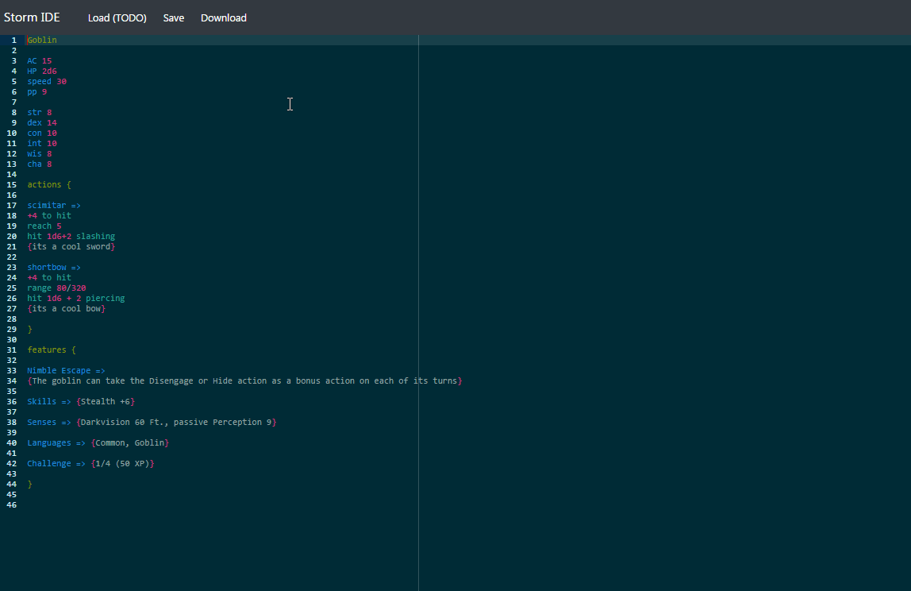
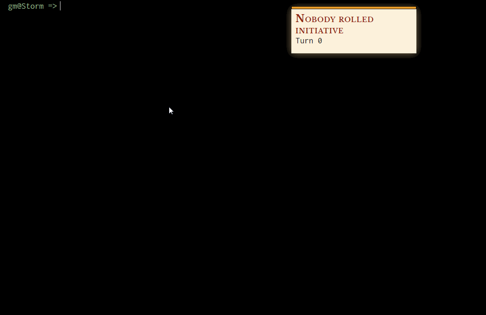

# StormD&D Specifications draft 

Toolchain with the goal to help a Dungeon Master run a D&D game.
This tool is meant to be used for live pen and papers sessions.

Most dice rolls should be done IRL, the toolchain should only
provide information like monster blocks and the state of an encounter.

The principal features should be to enable faster battles and content generation by providing :

- A data type that can describe a monster's stats block
  - an api that enables an easy manipulation of those data
  - a user-friendly way to add new blocks (currently StormIDE using Ace Editor)
- A Command Line Interface to easily manage a battle encounter
  - initiative tracking
  - Health tracking per monster
  - an easy access to the data of the monsters in the encounter
  - easy access to the state of the encounter (turn number, hp, ...)
  - the possibility to create an encounter in advance to be loaded in
  an encounter

- Integration with the players
    - create a room for the dm and the players
    - the players can update their hp and other stats
    - the players must not have access to the DM informations
    

### Releases
You can use the online tool : https://storm.florentpastor.com

You can download the executable :   

## StormLang

#### Current state:

## Storm interface

#### Current state:

